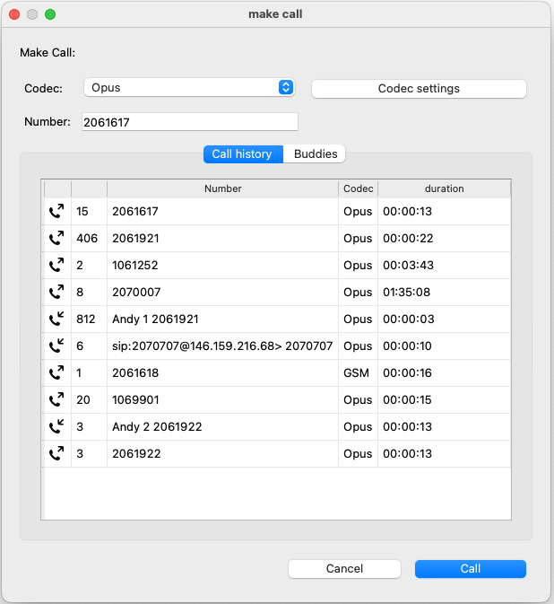

AWAH-SIP_GUI
============

The AWAH_SIP_GUI is a standalone GUI application to control the AWAH-SIP_Codec

Installation
------------

Donwload the newest version here: AWAH-SIP-GUI-download_.

.. note::

   You ndeed to singn in to GitLab in order to see the and download the files.

.. _AWAH-SIP-GUI-download: https://github.com/AWAH-SIP/AWAH-SIP_Desktop-GUI/actions

Starting the GUI
----------------

|

When you start the GUI a connect dialog appears. Enter the IP address of the AWAH-SIP_codec that
you want to control. If the application is running on the same host 127.0.0.1 can be entered.
If the connection is successful the Overview screen opens.

Overview
--------

|

Each line in the main view represents an account.

**Name:** The custom Name of a SIP account.

**User:** The SIP number or the user of an account.

**SIP state:** This indicates the state of an account. If this field is green the acocunt is properly registered on the SIP server.

**Call state:** The state of a call. This is green when a call is connected.

**Make Call:** By clicking on the telephone handset icon you can inititate or hang up a call.

**Info:** This opens an info window with call statistics if a call is connected.

Make a call
-----------

A click on the **telephone handset** icon opens the *make call* dialog:

|

The *make call* windows opens:

|

**Codec:** Select a codec from the dropdown. Supported codecs are: 
            ``Opus`` ``Speex`` ``iLBC`` ``AMR`` ``Linear`` ``GSM`` ``G722`` ``G711 u-Law`` ``G711 a-Law``

**Codec settings:** Opens the settings dialog with the specific parameters for the selected codec.

|

**Number:** Enter the SIP number you like to call.

**Call history:** the last 10 calls are displayed here, by clicking on an entry in the table the number, the codec and its settings are selected.

**Buddies:** quickdial entrys, this is like an interactive phonebook. By clicking on an entry in the table the number, the codec and its settings are selected. 
See section :ref:`Buddies` how to add and edit *buddies*

Call info
---------

A click on the **call info** icon opens the *call info* window. Various statistics for a active call are shown.

|

The call info window shows various information about the active call:

|

On the tab ``SDP`` you can inspect the SDP that is recieved from the far end if you are called.
If you are the caller then the local SDP that is sent out is displayed.

Auto connect
------------

With auto connect you can set up static connection to a SIP contact. 
As soon this contact is online the codec wil automatically establish a call to that contact.

|

The autoconnect field is a shortcut to **enable** or **disable** disable the autoconnect feature.
To use this you have to define some :ref:`Buddies` first.

