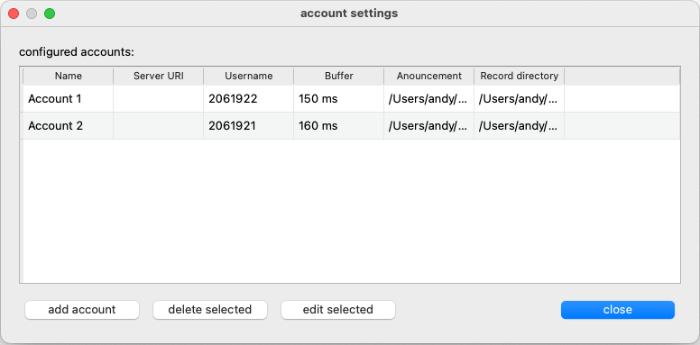
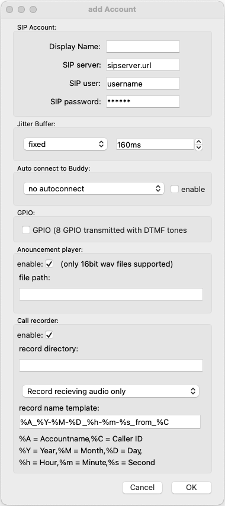
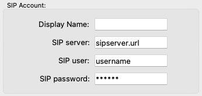
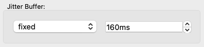
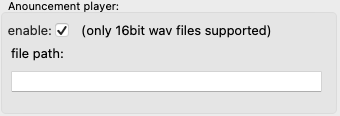
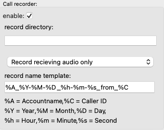

Account Config
==============

Accounts can be configured by clicking on the accounts symbol in the main view or by pressing :kbd:`ctrl` + :kbd:`a`

Each configured account is represented by a line in the table. Accounts can be added, edited or deleted using this window.

Add Account
-----------

A new Account can be configured in the **Add Account** window.

|

SIP Account
***********

|

.. list-table:: SIP Account
   :widths: 200 200 
   :header-rows: 1

   * - SIP Account
     - description

   * - Display Name
     - The Name for this account that shows up in the first column of the account table

   * - SIP server
     - The IP adress or the URI of the SIP server where the acccount should register.

   * - SIP user
     - the user name of the account

   * - SIP password
     - the password ot the account

|

Jitter buffer
*************

The jitter buffer chan be either fixed or adaptive. If it is set to a fixed value the buffer size can be set directly here in milliseconds.
The adaptive jitter buffer can be configured in the settings_.

.. _settings: https://awah-sip-documentanion.readthedocs.io/en/latest/AWAH-SIP_GUI_Settings.html

|

GPIO
****

.. image:: images/add_account_GPIO.png
  :width: 300
  :align: center
  :alt: GUI account GPIO

When the field GPIO is checked 8 GPI and 8 GPO will be created in the GPIO matrix. With this enabled you can transmit 8 GPI's over SIP. (This is done with DTMF tones)
See also section routing_ for details of the internal routing matrix.

.. _routing: https://awah-sip-documentanion.readthedocs.io/en/latest/AWAH-SIP_GUI_Routing.html

.. note::

   If GPIO is enabled GPI states are transmitted when a call gets established. If this call is trunked to a POTs network the DTMF tones can be heard on the phone!

|

Anouncement player
******************

If the Anouncement player ist enabled the file defined in **file path** is played on each incoming call.

.. warning::

   Only 16bit wave files are supported. 24bit files throw an eror in the log file and won't play!

|

Call recorder
*************

If the Call recorder is enabled each incoming call is recorded. Each recording is stored as a 16bit wave file in te directory defined in **record directory**
You can choose if you want to record only the incoming audio signal or record a mix of the recieving audio with the local audio (your voice)

With the field record name template you can define in a very flexible way how the individual files schould be named.

.. list-table:: Examples
   :widths: 200 200 
   :header-rows: 1

   * - Template
     - Filename

   * - MyRecording-%Y-%M-%D
     - MyRedording-2023-05-21.wav

   * - Callfrom-%C
     - Callfrom-2061921.wav

   * - %A_%Y-%M-%D_%h:%m:%s_from_%C
     - Accountname_2023-05-21_22:45:23_from_2061921.wav

.. note::

   If you enable **Anouncement Player** and **Call Recorder** the file recording starts after the anouncement is finished.
   Like this you get a fully functinal SIP anwering maschine.

Edit Account
------------

When you click on edit the same window as for adding accounts appears. You can edit each parameter.

. note::

   The password is not shown it is displayed as stars. If you leave this as it is the password remains the same. 
   If you like to change the password just type the new one in.

Delete account
--------------

just select an account an click delete to delet it and no, there is no undo.