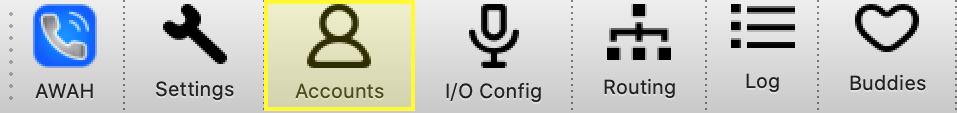

Account Config
==============

Accounts can be configured by clicking on the accounts symbol in the main view or by pressing :kbd:`ctrl` + :kbd:`a`

Each configured account is represented by a line in the table. Accounts can be added, edited or deleted in this window.

Add Account
-----------

Edit Account
------------