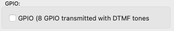

Account Config
==============

.. image:: images/GUI-Overview_account.png
  :width: 500
  :align: center
  :alt: GUI Accounts

Accounts can be configured by clicking on the accounts symbol in the main view or by pressing :kbd:`ctrl` + :kbd:`a`

.. image:: images/account_settings.png
  :width: 500
  :align: center
  :alt: GUI settings:

Each configured account is represented by a line in the table. Accounts can be added, edited or deleted using this window.

Add Account
-----------

|

A new Account can be configured in the **Add Account** window.

|

|

.. list-table:: SIP Account
   :widths: 200 200 
   :header-rows: 1

   * - SIP Account
     - description

   * - Display Name
     - The Name for this account that shows up in the first column of the account table

   * - SIP server
     - The IP adress or the URI of the SIP server where the acccount should register.

   * - SIP user
     - the user name of the account

   * - SIP password
     - the password ot the account

|

The jitter buffer chan be either fixed or adaptive. If it is set to a fixed value the buffer size can be set directly here in milliseconds.
The adaptive jitter buffer can be configured in the settings_.

.. _settings: https://awah-sip-documentanion.readthedocs.io/en/latest/AWAH-SIP_GUI_Settings.html

|

|

When the field GPIO is checked 8 GPI and 8 GPO will be created in the GPIO matrix. With this enabled you can transmit 8 GPI's over SIP. (This is done with DTMF tones)
See also section routing_ for details of the internal routing matrix.

.. _routing: https://awah-sip-documentanion.readthedocs.io/en/latest/AWAH-SIP_GUI_Routing.html

.. note::

   If GPIO is enabled GPI states are transmitted when a call gets established. If this call is trunked to a POTs network the DTMF tones can be heard on the phone!

|

|

If the Anouncement player ist enabled the file defined in **file path** is played on each incoming call.

.. warning::

   Only 16bit wave files are supported. 24bit files throw an eror in the log file and won't play!

Edit Account
------------