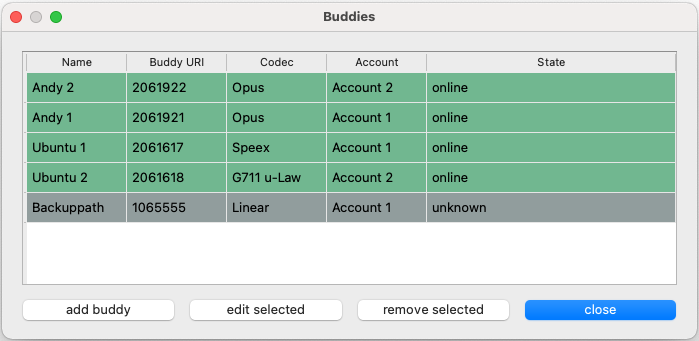

Buddies
=======

|

Buddies are bayically contacts in a phonebook they can be configured by clicking on the **Buddies** icon.

Each configured buddy is shown as a separate line in the table. A Buddy consists of a **name** the corresponing **sip uri**, **codec settings** and the **account** that owns the buddy.

add Buddy
---------

Buddy settings
--------------