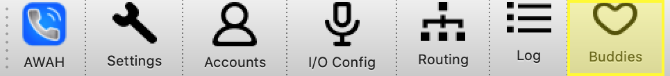

Buddies
=======

|

Buddies are bayically contacts in a phonebook they can be configured by clicking on the **Buddies** icon.

.. image:: images/Buddies.png
  :width: 300
  :align: center
  :alt: GUI settings:

Each configured buddy is shown as a separate line in the table. A Buddy consists of a **name** the corresponing **sip uri**, **codec settings** and the **account** that owns the buddy.

There are three different states that are indicated with colors.

.. list-table:: buddy states
   :widths: 200 200 
   :header-rows: 1

   * - state
     - description

   * - .. image:: images/buddy_unknown.png
        :width: 100
        :align: center
        :alt: GUI unknwonn
     - the contact is either offline or the other side don't support SIP presence extention (RFC 3856)

   * - .. image:: images/buddy_online.png
        :width: 100
        :align: center
        :alt: GUI online

     -  the contact is online and available.

   * - .. image:: images/buddy_busy.png
        :width: 100
        :align: center
        :alt: GUI buddy_busy
     - the contact is already in a call.

add Buddy
---------

In the add buddy window you can configure a new buddy. You can choose a custom **Name** for the contact and add the SIP number in the **Number** field.
You need to specify an account for your buddy. This is neccesary that the application can extend the number to a fully specified SIP URI e.g. sip:123456@voip-provider.example.net

Buddy settings
--------------