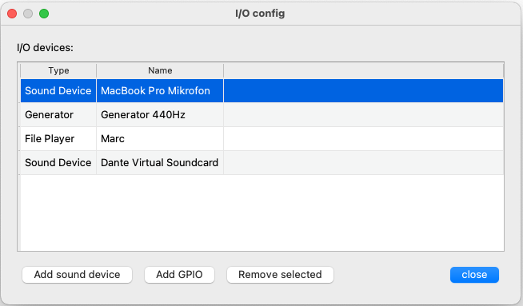
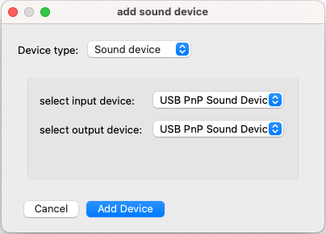
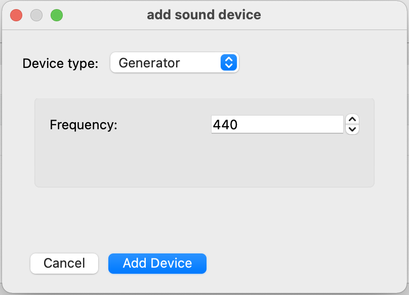
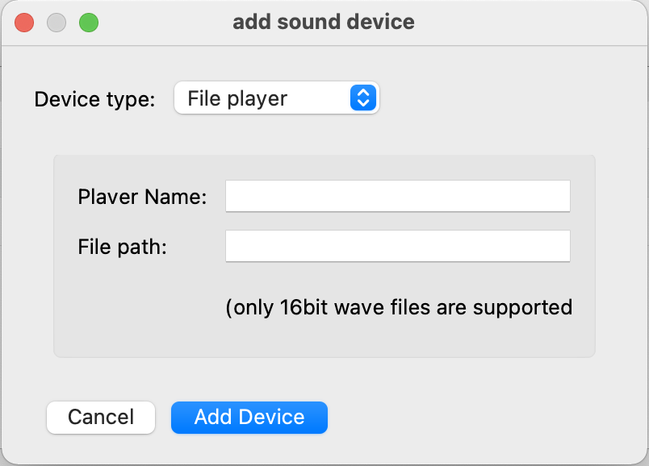

Input and Output Configuration
==============================

Sound devicces, file player, generator and GPIO devices can be configured by clicking on the **I/O Config** button.

Each configured device is represented by a line in the table. There are two categories of devices. **Sound devices** and **GPIO devices**
The configured devices are automatically added to the routing matrix.

|

Add sound device
----------------

Ther are tree different type of sound devices

.. list-table:: Sound devices
   :widths: 200 200 
   :header-rows: 1

   * - Device type
     - description

   * - Sound Device
     - Sound card USB sound devices

   * - Generator
     - test tone generator with selectable frequency

   * - File player
     - Select a file that is played in a loop.

|

Add Sound device
****************

Select in the dropdown menu on of de devices that are present in the systems. You need to select the input and the outout device individually

.. note::

   You can configure multiple sound devices. Just one device can act as the clock source. After the sound device is configured it can be selected as clock source in the settigs page.

|

Add Generator
*************

The generator device outputs a plain sine wave. You can choose the frequency of the testtone.

|

Add File player
***************

.. list-table:: File  player
   :widths: 200 200 
   :header-rows: 1

   * - Name
     - description

   * - Player Name
     - Choose a name for your player (it will appear with this name in the routig matrix)

   * - File Path
     - enter the Path to an exising wave file on your disk (only 16bit wave files are supported)

|

Add GPIO
--------

|

Remove selected
---------------