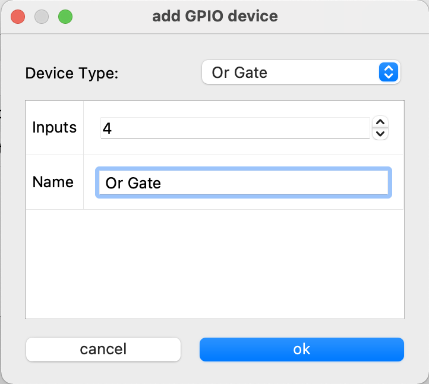

Input and Output Configuration
==============================

Sound devicces, file player, generator and GPIO devices can be configured by clicking on the **I/O Config** button.

Each configured device is represented by a line in the table. There are two categories of devices. **Sound devices** and **GPIO devices**
The configured devices are automatically added to the routing matrix.

|

Add sound device
----------------

There are tree different types of sound devices

.. list-table:: Sound devices
   :widths: 200 200 
   :header-rows: 1

   * - Device type
     - description

   * - Sound Device
     - Sound card USB sound devices

   * - Generator
     - test tone generator with selectable frequency

   * - File player
     - Select a file that is played in a loop.

|

Add Sound device
****************

.. image:: images/add_sounddevice.png
  :width: 300
  :align: center
  :alt: IO sound device

Select in the dropdown menu on of de devices that are present in the systems. You need to select the input and the outout device individually

.. note::

   You can configure multiple sound devices. Just one device can act as the clock source. After the sound device is configured it can be selected as clock source in the settigs page.

|

Add Generator
*************

The generator device outputs a plain sine wave. You can choose the frequency of the testtone.

|

Add File player
***************

.. image:: images/add_fileplayer.png
  :width: 300
  :align: center
  :alt: IO generator

.. list-table:: File  player
   :widths: 200 200 
   :header-rows: 1

   * - Name
     - description

   * - Player Name
     - Choose a name for your player (it will appear with this name in the routig matrix)

   * - File Path
     - enter the Path to an exising wave file on your disk (only 16bit wave files are supported)

|

Add GPIO
--------
There are six different types of GPIO devices:

.. list-table:: GPIO devices
   :widths: 200 200 
   :header-rows: 1

   * - Device type
     - description

   * - GPIO AND
     - a logical AND gate

   * - GPIO OR
     - a logical OR gate

   * - virtual GPIO
     - a vitual GPIO device that can be set over the Websocket API

   * - Linux GPIOD GPIO
     - a Linux libgpiod device for accessing GPIO headers

   * - set Audio Crosspoint GPIO
     - a GPIO decive that can set a crosspoint on the audio matrix

|

add GPIO AND
************

A logic AND gate. **Inputs** sets the amount of inputs. **Name** the name of the AND Gate.
If every input of ghe AND gate is true the output gets also true.

|

add GPIO OR
***********

A logic OR gate. **Inputs** sets the amount of inputs. **Name** the name of the OR Gate.
If one of the inputs of ghe OR gate is true the output gets true.

|

add virtual GPIO
****************

A virtual GPIO is just a GPI or GPO represented in the GPIO matrix. The vertual GPIO can be set to true or false over the Websocket API.
**Inputs** sets the amount of inputs. **Outputs** sets the amount of outputs. **Name** the name of the virtual GPIO.

add Linux GPIO
**************

With a linux GPIO device you can access GPIO pins on an embedded board like the Rasperrypi directly. 
You need to compile the AWAH sip codec with libgpiod_ support enabled that this GPIO device is showing up.

.. _libgpiod: https://git.kernel.org/pub/scm/libs/libgpiod/libgpiod.git

|

add Audio crosspoint GPIO
*************************

If the input of the **Audio crosspoint GPIO device** is true. The **source Port** is routed to the **destination Port** in the audio matrix.
If the input is false the specified route is removed.
|
**Name** the name of the device. **Source Port** the Audio soucre channel that schould be routed. **Destination Port** the audio output that the signal schould be routed.$
**Level** this defines the level (in dB) of the connection 0 means unity gain. A positive value is a boost of the input signal and a negative value an attenuation. 
|

Remove selected
---------------