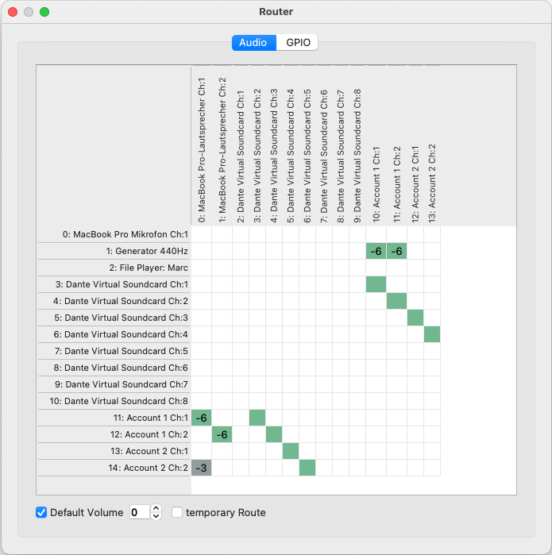
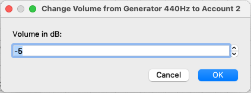
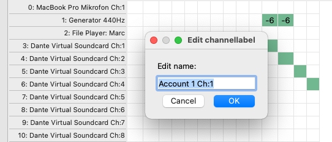
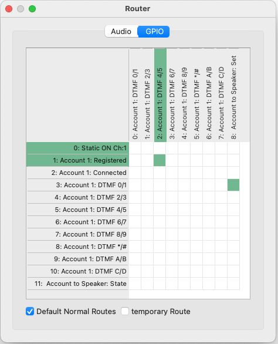

Routing
=======

There are two crosspoint matrixes available in one for managing all the audio sources and sink and a second one for GPIO routing.
Both can be accessed by clicking on the **router** icon or by pressing  :kbd:`ctrl` + :kbd:`r`

Audio routing
-------------

With the audio router you can connect the input and outputs of your SIP accounts and sound devices with each other.
The router is a fully functional summing matrix this means you can add multiple inputs to one single output.

.. list-table:: crosspoints
   :widths: 200 200 
   :header-rows: 1

   * - Crosspoint type
     - description

   * - .. image:: images/Audio_router_XP.png
        :width: 40
        :align: center
        :alt: GUI XP
     - A green crosspoint without text that indicates a connection without any gain change

   * - .. image:: images/Audio_router_XP_gain.png
        :width: 40
        :align: center
        :alt: GUI XP gain

     - the gain or attenuation is indicated directly on the crosspoint (value in dB)

   * - .. image:: images/Audio_router_XP_grey.png
        :width: 40
        :align: center
        :alt: GUI XP grey
     - a gray crosspoint is a temporary crosspoint that is non constistent over a restart of the application.

A click on a white square sets a crosspoint and a click on a crosspoint cleas the connection.

With a right click on a crosspoint you can alter the gain of this connection. A negative value is an attenuation of the signal and a positive value is a signal boost.

When you need to set multiple crosspoints with a gain other than 0dB you can change the default volume setting at the bottom of the window.

By checking the **temporary Route** checkbox each new crosspoint will just be temporary. (indicated with a grey crosspoint)
A temporary crosspoint is not saved in the configuration. It will be lost after a reboot of the codec.

With a double click of a name (either input or output) a window opens where you can change the name of a channel.

GPIO routing
------------

All GPIO devices can be connectet in the GPIO matrix. A source or a destination that is maked **green** has the state **true** or **hi**.

.. list-table:: GPI crosspoints
   :widths: 200 200 
   :header-rows: 1

   * - Crosspoint type
     - description

   * - .. image:: images/GPI_XP_green.png
        :width: 40
        :align: center
        :alt: GUI XP
     - A green crosspoint without text that indicates a connection.

   * - .. image:: images/GPI_XP_inverted.png
        :width: 40
        :align: center
        :alt: GUI XP gain

     -  A xrosspoint with a **!** is an inverting crosspoint. A **true** on the source will be a **false** on the destinatiln and vice versa.

   * - .. image:: images/GPI_XP_grey.png
        :width: 40
        :align: center
        :alt: GUI XP grey
     - a gray crosspoint is a temporary crosspoint that is non constistent over a restart of the application.

.. note::

 THe account DTMF GPI devices are only avaliable when they are enabled in the account config. See secction accounts for details.
