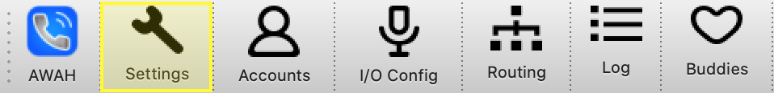

Settings
========

|
All the relevant settings can be accessed by clicking on the **settings** icon.

Global settings
---------------

.. image:: images/Global_settings.png
  :width: 300
  :align: center
  :alt: GUI global settings:
|

.. list-table:: global settings
   :widths: 200 500 
   :header-rows: 1

   * - Setting
     - description
     
   * - Account retry interval:
     - Time in seconds wich the codec waits after a unsuccessful SIP registration

   * - Audio frame package time:
     - The internal package time of the audio processing engine

   * - Buddy precence refresh time:
     - this defines how often a buddy gets refreshed. Each buddy refresh means a SIP message to each contact.

   * - Call disconnect after RX lost:
     - After this time (in seconds) the codec terminates an active call as soon as no more RTP packets are received. This terminates orphaned connections. 0 disables this function.

   * - Log level:
     - Select the desired log level with this drop down menu. For production use 3 or smaller is recommended.

   * - Log path:
     - choose a location where the log files schould be written to. Only the last 50 log files are kept.

   * - Max Calls:
     - The maximum simultaneous calls. 

   * - Max call duration:
     - All calls can be limited to a maximum call duration (set in minutes). A call gets automatically terminated if it exceeds this duration. A value of 0 turns this feature off.

   * - Router max channel:
     - this sets how many channel an account will have. (1 = mono, 2 = stereo)

SIP settings
------------

.. image:: images/SIP_settings.png
  :width: 300
  :align: center
  :alt: GUI call statisits:
|

Audio settings
------------

|
SIP settings found here.
