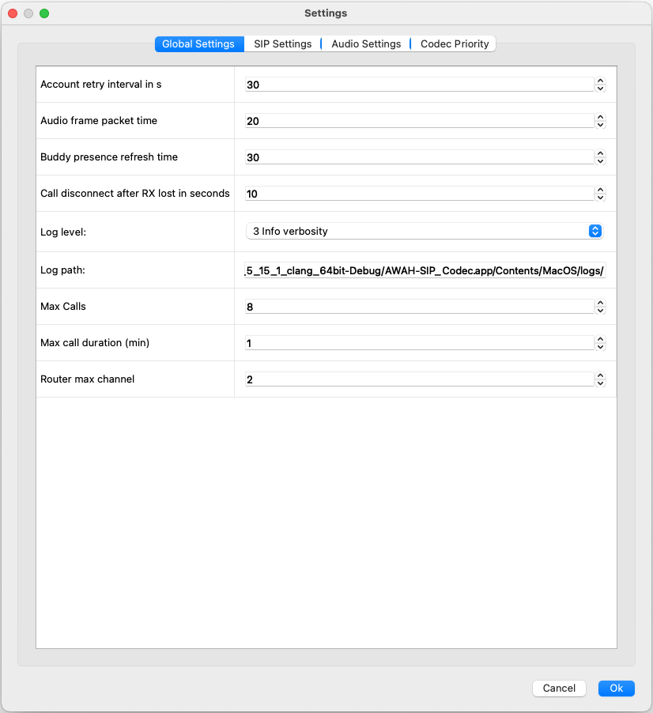

Settings
========
.. image:: images/GUI-Overview_settings.png
  :width: 600
  :align: center
  :alt: GUI settings:
|
All the relevant settings can be accessed by clicking on the **settings** icon.

Global settings
---------------

|

.. list-table:: global settings
   :widths: 200 300 
   :header-rows: 1

   * - Setting
     - description

   * - Audio frame package time:
     - The internal package time of the audio processing engine

   * - Buddy precence refresh time:
     - this defines how often a buddy gets refreshed. Each buddy refresh means a SIP message to each contact.

   * - Call disconnect after RX lost:
     - After this time (in seconds) the codec terminates an active call as soon as no more RTP packets are received. This terminates orphaned connections. 0 disables this function.

   * - Log level:
     - Select the desired log level with this drop down menu. For production use 3 or smaller is recommended.

   * - Log path:
     - choose a location where the log files schould be written to. Only the last 50 log files are kept.

   * - Max Calls:
     - The maximum simultaneous calls. 

   * - Max call duration:
     - All calls can be limited to a maximum call duration (set in minutes). A call gets automatically terminated if it exceeds this duration. A value of 0 turns this feature off.

   * - Router max channel:
     - this sets how many channel an account will have. (1 = mono, 2 = stereo)

SIP settings
------------

|

.. list-table:: SIP settings
   :widths: 200 300 
   :header-rows: 1

   * - Setting
     - description

   * - Account session timer expiration
     - Default session interval for Session Timer (RFC 4028) extension, in seconds.

   * - ICE
     - enable or disable Interactive Connectivity Establishment (ICE) rfc5768

   * - ICE Rtcp
     - enable ore disable RTCP component.

   * - ICE agressive nomination
     - enable or disable agressive nomination
    
   * - ICE always update
     - Always send re-INVITE/UPDATE after ICE negotiation regardless of whether the default ICE transport address is changed or not. When this is disabled, re-INVITE/UPDATE will be sent only when the default ICE transport address is changed.

   * - ICE max host candidates
     - Set the maximum number of ICE host candidates.

   * - ICE nominated check delay
     - For controlling agent if it uses regular nomination, specify the delay (in milliseconds) to perform nominated check

   * - ICE nomination timeout
     - For a controlled agent, specify how long it wants to wait (in milliseconds) for the controlling agent to complete sending connectivity check

   * - Media config transport port
     - this sets the UDP port for the media to flow
    
   * - NAT hole punching keep alive timer
     - Set the interval for periodic keep-alive transmission for every account. If this value is zero, keep-alive will be disabled.

   * - auto registration retry upon registration failure
     - Specify interval of auto registration retry upon registration failure (including caused by transport problem), in second. Set to 0 to disable auto re-registration. Note that if the registration retry occurs because of transport failure, the first retry will be done after **first retry interval** instead.

   * - interval for the first registration retry
     - This specifies the interval for the first registration retry.

   * - rewrite contact in SIP header
     - This option is used to update the transport address and the Contact header of REGISTER request. When this option is  enabled, the library will keep track of the public IP address from the response of REGISTER request. Once it detects that the address has changed, it will unregister current Contact, update the Contact with transport address learned from Via header, and register a new Contact to the registrar. This will also update the public name of UDP transport if STUN is configured.

   * - rewrite via in SIP header
     - This option is used to overwrite the "sent-by" field of the Via header for outgoing messages with the same interface address as the one in the REGISTER request, as long as the request uses the same transport instance as the previous REGISTER request.

Audio settings
------------

.. image:: images/audio_settings.png
  :width: 300
  :align: center
  :alt: GUI call statisits:
|
.. list-table:: audio settings
   :widths: 200 300 
   :header-rows: 1

   * - Setting
     - description

   * - echo canceller tail length
     - Echo canceller tail length, in miliseconds. Setting this to zero will disable echo cancellation.

   * - Jitterbuffer initial prefetch delay
     - Jitter buffer minimum prefetch delay in msec.

   * - Jitterbuffer max
     - Set maximum delay that can be accomodated by the jitter buffer msec.

   * - Jitterbuffer prefetch Max
     - Jitter buffer maximum prefetch delay in msec.

   * - Jitterbuffer prefetch Min
     - Jitter buffer minimum prefetch delay in msec.

   * - Router clock rate
     - Sets the clock rate of the audio routing matrix

   * - Router clock source
     - select from wich audio interface the router schould take the clock, or set to internal clocking if no audio interface is connected.

   * - Sound device clock rate
     - Sets the clock rate of the selected audio interface

   * - Sound device plackback buffer
     - sets the playback buffer in milliseconds for the sound device

   * - Sound device record buffer
     - sets the record buffer in milliseconds for the sound device

Codec Priority
--------------

Set the priority for each available codec. If an incoming call has multiple codecs offered in the SDP the codec with the highest priority will be selected.
If a codec is set to **0 disabled** a call with this codec will be refused.

